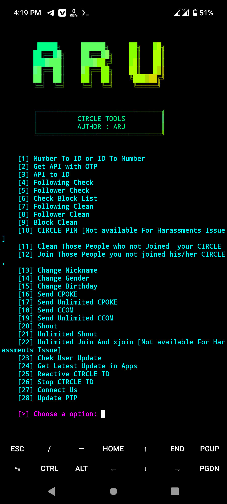

<!-- CIRCLE_TOOLS -->
<!-- CODED BY ARU -->

<p align="center">
  
</p>

<p align="center">
  
  
</p>

<p align="center">
  
  
  
</p>
<br>
<br>

> <h2><p align='center'><b>DISCLAIMER:</b></p></h2>
> <p><i>This script is create only for enhancing <b>Robi and Airtel Circle</b> experience and personally for keeping everything in practice with a realtime project.</i></p>
<br><br>


## Features

- <a href='#number-to-id-or-id-to-number'>ID TO NUMBER</a>
- <a href='#number-to-id-or-id-to-number'> NUMBER TO ID </a>
- API GENERATE WITH OTP
- API TO CIIRCLE ACCOUNT INFO
- GET FOLLOWING LIST
- GET BLOCK LIST
- GET BLOCK LIST
- CLEAN FOLLOWING LIST
- CLEAN FOLLOWER LIST
- CLEAN BLOCK LIST
- CLEAN THOSE PEOPLE WHO NOT JOIEND YOUR CIRCLE
- JOIN THOSE PEOPLE YOU NOT JOIEND HIS/HER CIRCLE
- CHANGE NICKNAME 
- CHANGE GENDER
- CHANGE BIRTHDAY
- SEND CPOKE
- SEND CPOKE UNLIMITED
- SEND CCOM
- SEND CCOM UNLIMITED
- AUTO SHOUT
- AUTO SHOUT UNLIMITED
- CHECK USER UPDATE
- GET LATEST UPDATE IN APP 
- REACTIVE CIRCLE ID
- STOP CIRCLE ID


> ## DESCRIPTION
> **It is one of the tools of `ROBI CIRCLE`. It is developed with the programming language `Python`. It can be used only by `Bangladeshi` citizens.**
> - ### Number To ID or ID To Number
> **Many times `ROBI CIRCLE` user needs `Number` from `ROBI CIRCLE` ID or `ROBI CIRCLE` ID from `Number`. You can get `Number from `ROBI CIRCLE ID` or `ROBI CIRCLE ID` from `Number` by using ``Number To ID or ID To Number`` method.**
>  


<br>
<h2> Notes: </h2>
⚙ Our Tool is Absolutely Free, Don't Sell or Buy Anyone

<br>
<br>


<div align='center'><h1> USE </h1></div>

### Requried Pkg and Liberies
- Update your `Pkg` -
```
 pkg update 
```
```
 pkg upgrade 
```


- Install `Python` -

```
 pkg install python 
```
- install `git`
```
 pkg install git 
```

- Install `libraries` -
```
pip install circlerobi
```
```
pip install requests
```
```
pip install lolcat
```

### Install ``CIRCLE_TOOLS``

- Clone this repository -
```
 git clone https://github.com/Aru-Ofc-git/CIRCLE_TOOLS.git
```

- Change to cloned directory and run `circle.sh` -
```
 cd CIRCLE_TOOLS
```
```
 bash circle.sh
```
### Single `Command`-
```
 pkg update -y && pkg upgrade && pkg install python -y && pip install requests && pip install circlerobi && git clone https://github.com/Aru-Ofc-git/CIRCLE_TOOLS.git && cd CIRCLE_TOOLS && bash circle.sh
```


### Screenshots
<p align="center">
    
</p>
<br>

<p align="left">
  <a href="https://github.com/Aru-Ofc-Git" target="_blank"></a>
  <a href="https://www.facebook.com/Aru.Ofc" target="_blank"></a>
  <a href="https://m.me/1R13A14" target="_blank"></a>
 <a href="https://youtube.com/c/ARULyrics1" target="_blank"></a>
</p>
