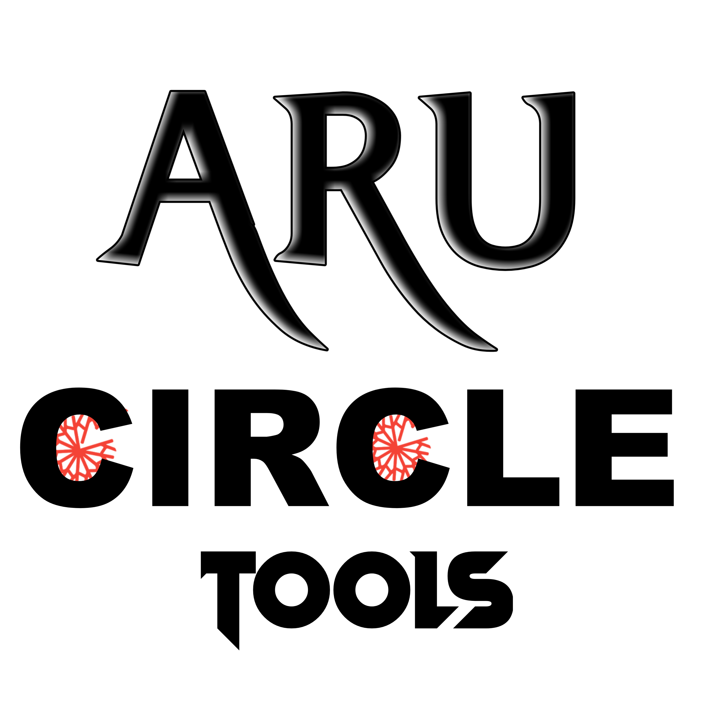
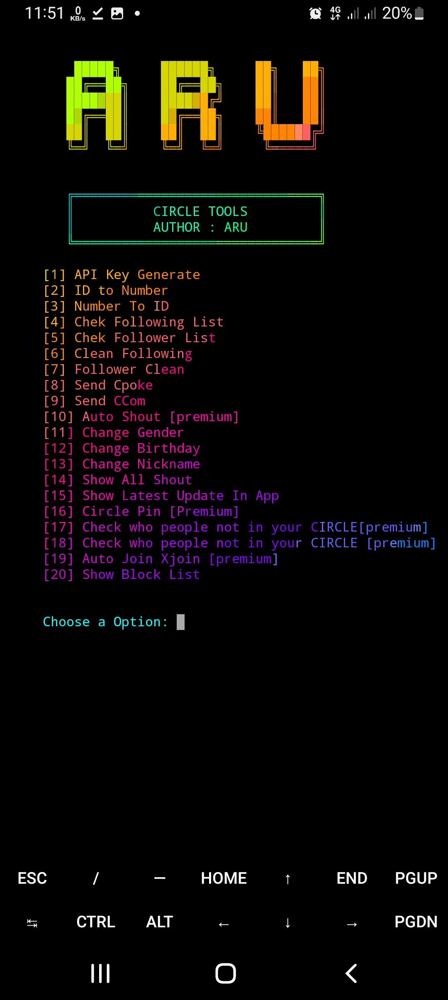

<!-- CIRCLE_TOOLS -->
<!-- CODED BY ARU -->

<p align="center">
  
</p>

<p align="center">
  
  
</p>

<p align="center">
  
  
  
</p>


<h3><p align="center">Disclaimer</p></h3>
<p><i>This script is create only for enhancing <b>Robi and Airtel Circle</b> experience and personally for keeping everything in practice with a realtime project.
</i></p>
<br>
<br>


## Requried Pkg and Liberies
- Update your `Pkg` -
```
 pkg update 
```
```
 pkg upgrade 
```


- Install `Python` -

```
 pkg install python 
```
```
 pkg install python2
```
- install `git`
```
 pkg install git 
```

- Install `libraries` -
```
pip install aiohttp 
```
```
pip install requests
```


### Install ``CIRCLE_TOOLS``

- Clone this repository -
```
 git clone https://github.com/Aru-Ofc-git/CIRCLE_TOOLS.git
```

- Change to cloned directory and run `circle.py` -
```
 cd CIRCLE_TOOLS
```
```
 python circle.py
```
### Single `Command`-
```
 pkg update -y && pkg upgrade && pkg install python -y && pkg install python2 -y && pip install requests && git clone https://github.com/Aru-Ofc-git/CIRCLE_TOOLS.git && cd CIRCLE_TOOLS && python circle.py
```


### Screenshots
<p align="center">
    
</p>
<br>


# About Premium Tools

### Auto Shout 

<p>Sometimes you may need to do automatic <b>shout</b> one after the other. You can do that from our tools.</p>
<br>
<br>
<h3> Check who people not in your CIRCLE</h3>
<p>If you have <b>joined </b>someone in <b>Robi Circle </b>but have not joined you, you can find their profile and <b>xjoin</b> or <b>block</b> them.</p>
<br>
<br>
<h3>Check who people not in your CIRCLE</h3>
<p>You can find people who have <b>joined </b>you in<b> Robi Circle <b/>but you haven't And you can <b>join or block </b>if you want</p>
<h3> Find Me on :</h3>
<p align="left">
  <a href="https://github.com/Aru-Ofc-Git" target="_blank"></a>
  <a href="https://www.facebook.com/Aru.Ofc" target="_blank"></a>
  <a href="https://m.me/1R13A14" target="_blank"></a>
 <a href="https://youtube.com/c/ARULyrics1" target="_blank"></a>
</p>
